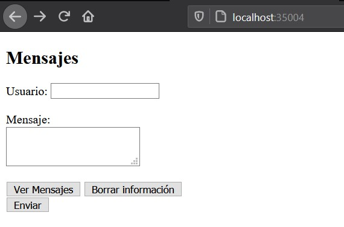

# AREP - Laboratorio #5
La aplicación consiste en un servicio llamado AppRoundRobin, este se encarga de recibir las peticiones del cliente y enviarlas al servicio REST. El servicio REST recibe la cadena e implementa un algoritmo de balanceo de cargas de Round Robin, delegando el procesamiento del mensaje y el retorno de la respuesta a cada una de las tres instancias del servicio SparkWebServer. El servicio SparkWebServer es quien se encarga de guardar y pedir datos de una base de datos MongoDB.
El cliente solo puede acceder al servicio web que AppRoundRobin provee y esta desplegado en un contenedor docker en una instancia EC2 de AWS. Los demas servicios como el servidor web (SparkWebServer) y la base de datos solo pueden ser accedidos por contenedores de Docker dentro de la instancia EC2 y que compartan red. 

## Conceptos

### RoundRobin
Round-robin es un método para seleccionar todos los abstractos en un grupo de manera equitativa y en un orden racional, normalmente comenzando por el primer elemento de la lista hasta llegar al último y empezando de nuevo desde el primer elemento.

### Docker
Docker", el software de TI, es una tecnología de creación de contenedores que permite la creación y el uso de contenedores de Linux®. Con docker, puede usar los contenedores como máquinas virtuales extremadamente livianas y modulares.

## Comenzando 
Para obtener una copia local del repositorio puede ejecutar la siguiente línea en la consola de comandos.
    
    git clone https://github.com/Ricar8o/AREP-Lab05-SparkDocker.git

## Pre-requisitos

Debe tener instalado lo siguiente:

* [GIT](https://git-scm.com/book/es/v2/Inicio---Sobre-el-Control-de-Versiones-Instalación-de-Git)
* [JAVA 8](https://www.java.com/es/download/)
* [MAVEN](https://maven.apache.org)
* [DOCKER](https://www.docker.com/)
* **DOCKER-COMPOSE** - Viene incluido en Docker Desktop, sin embargo si no lo tiene, puede ver como instalarlo [AQUI](https://docs.docker.com/compose/install/).

GIT no es completamente necesario pero si es recomendable, también puede descargar el repositorio como un .zip.

## Otras Tecnologías
* [MongoDB](www.mongodb.com) - MongoDB es una base de datos de documentos que ofrece una gran escalabilidad y flexibilidad, y un modelo de consultas e indexación avanzado.
* [CircleCI](https://circleci.com/) - Es una plataforma que ofrece integración continua en el codigo.

## Pruebas y Compilación

Para compilar el proyecto podemos ejecutar varias opciones. 

* Para compilar el codigo fuente únicamente.

        mvn compile

* Para ejecutar todas las fases.

        mvn package

## Ejecución
En este repositorio hay dos clases principales [SparkWebServer.java](src/main/java/co/edu/escuelaing/sparkdocker/SparkWebServer.java)
y [AppRoundRobin.java](src/main/java/co/edu/escuelaing/sparkdocker/AppRoundRobin.java).

IMPORTANTE! - Antes de cualquier ejecución asegurese de haber compilado o ejecutado mvn clean install.

### Ejecuciones basicas de las clases.

#### SparkWebServer
Esta clase es la clase principal del servicio web  que se conecta a la base de datos y que será replicado tres veces.
Si desea probarlo por si solo hay varias opciones:
Para los servicios web esta clase usa el FrameworkSpark

**JAVA Linux**

        java -cp target/classes/:target/dependency/* co.edu.escuelaing.sparkdocker.SparkWebServer

**JAVA Windows**

        java -cp target/classes/;target/dependency/* co.edu.escuelaing.sparkdocker.SparkWebServer

Si desea que envie datos o los lea de una base de datos MongoDB, en el contructor de la clase MessageService debe poner la ip y el puerto por el que este funcionando su base de datos. 

#### AppRoundRobin
Esta clase es la clase principal de la aplicación, es quien recibe las solicitudes del cliente y le delega lo que se hara y la respuesta a varias instancias de SparkWebServer, como argumentos debe poner las ip de las instancias.
Para los servicios web esta clase usa el FrameworkSpark

**JAVA Linux**

        java -cp target/classes/:target/dependency/* co.edu.escuelaing.sparkdocker.AppRoundRobin <IP1:PORT> <IP2:PORT> ....

**JAVA Windows**

        java -cp target/classes/;target/dependency/* co.edu.escuelaing.sparkdocker.AppRoundRobin <IP1:PORT> <IP2:PORT> ....

### Ejecucion en Docker

        docker-compose build
        docker-compose up -d

Estos tres comandos se encuentran en el archivo [commands.txt](commands.txt), de manera que si se encuentra en un ambiente Linux solo debe poner:

        sh commands.txt

En Docker la aplicación siempre se ejecutara por el puerto 35004 del host. 

En el archivo [docker-compose.yml](docker-compose.yml) están las ip y los puertos de cada uno de los contenedores, se ve que solo el contenedor de AppRoundRobin tiene mapeado su puerto 6000 en el contenedor con el 35004 de la maquina donde se este ejecutando.

SparkWebServer se construye apartir del archivo [Dockerfile](Dockerfile)
AppRoundRobin se construye apartir del archivo [Dockerfile2](Dockerfile2)

**Distribución de los contenedores en Docker:**

sparkdockerNetwork es la red que comparten dentro de docker los contenedores.

#### Demostración Local
Al construir y tener iniciados los contenedores en docker con cada una de las instacias, podremos acceder a una pagina de inicio en [localhost:35004](http://localhost:35004), esta tiene un formulario con tres opciones, enviar el mensaje, ver los mensajes y limpiar la información del formulario.

Después de enviar la información, en formulario mandara una solicitud post al servicio REST con el contenido del formulario, este servicio escogera una de las instancias conectadas a la base de datos para pedirle que guarde la información del mensaje.

Para ver los últimos 10 mensajes guardados en la base de datos hay que hacer click en el botón que dice: "Ver mensajes". Entonces el servicio Rest pedira los mensajes a alguna de las instancias y redirigira a la url del API con los mensajes en formato JSON.

Se ven así, ya que Firefox tiene un visor de JSON. Para verlos de una manera más cómoda.

Sin el visor, el JSON se mostrará así:

**Demostracion Balanceo de Carga**
En los logs del contenedor donde se esta ejecutando AppRoundRobin se ve como cada solicitud que se hace la manda por turnos a los servicios conectados a la base de datos, desde el primero hasta el último y después volviendo a empezar:

Ahora si pedimos los mensajes vemos que no esta el primer mensaje, ya que solo devuelve los últimos 10 y los mensajes en la base de datos son 11.

#### Demostración AWS

Contenedores creados en instancia EC2 de AWS.

Primer mensaje enviado a la base de datos.

Al hacer **docker network inspect** en la red de los contenedores se puede observar que estan asignadas segun el docker-compose

Mirando los logs del contenedor round_robin vemos que está haciendo el balanceo de carga.

## Despliegue Circleci

## Documentación

La documentacion se encuentra en la carpeta del repositorio llamada [docs](docs), pero en caso de que quiera generarla tiene las siguientes opciones.

### Maven
Para generar la documentacion con Maven puede ejecutar cualquiera de los siguientes comandos.

*        mvn javadoc:javadoc
*        mvn javadoc:jar

## PDF Diseño

[Arep_Lab_5.PDF](Arep_Lab_5.pdf)

## Autor 

Andrés Ricardo Martínez Díaz - [Ricar8o](https://github.com/Ricar8o)

## Licencia
Mire el archivo [LICENSE](LICENSE) para más detalles.
